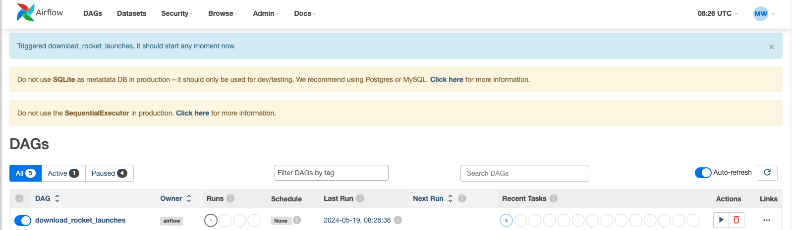
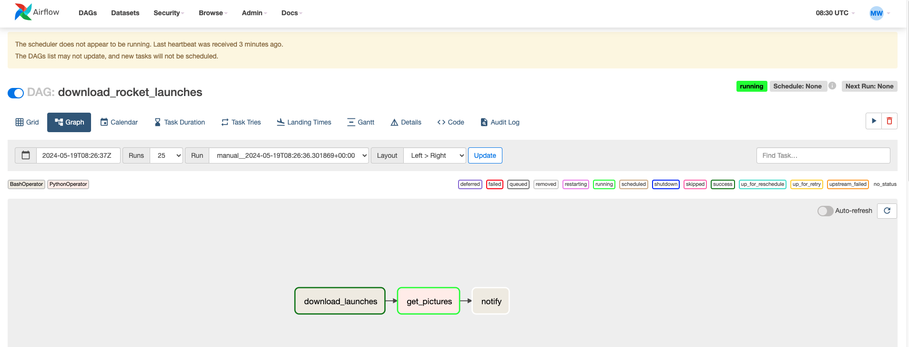
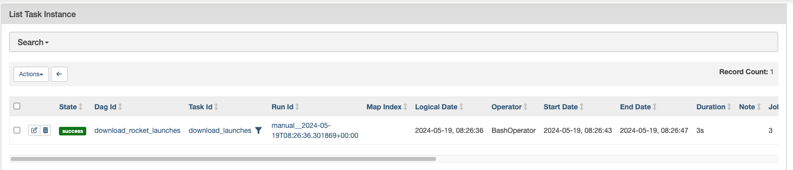

## Rocket Launches Example DAG

- Airflow 의 Workflow 는 DAG 로 표시한다. 
- Operator 는 단일 Task 를 나타낸다. 
- DAG 안에 있는 Task 는 어디에 위치하던지 재시작할 수 있다. 

- Airflow Webserver 에서 DAG 를 Trigger 하여 실행한다. 

- DAG를 Graph 로 확인하면 다음과 같다. 

- 실행 결과 
